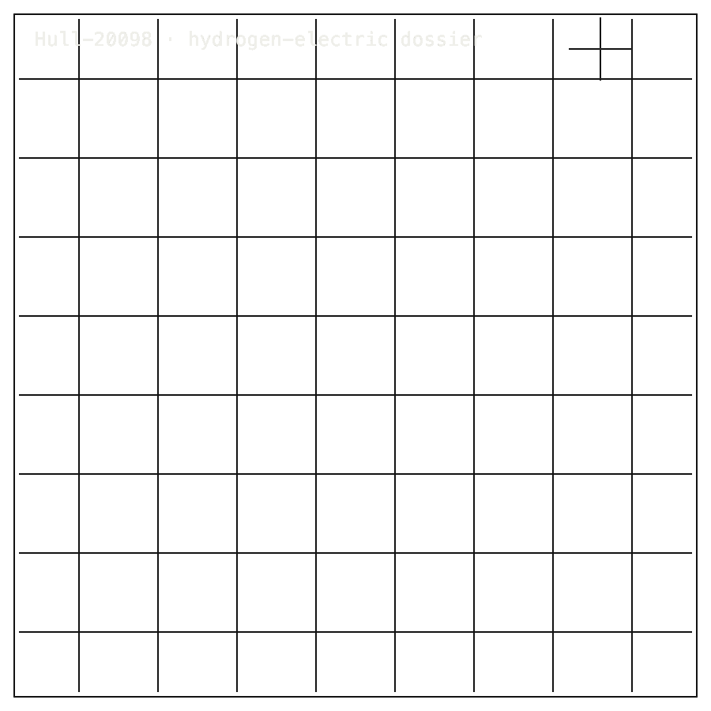

# Zero-Class-Vessel-Hull-20098

## Install / Developer Commands

<!-- INSTALL-DX:START -->
#### Package Boundary

Design dossier only: no public Python package, PyPI distribution, simulation tool, or CLI is claimed.
Use the repo-local source, dossier, or proof commands below; do not substitute an unrelated PyPI package.
<!-- INSTALL-DX:END -->

#### Quick Start

```bash
git clone https://github.com/Zer0pa/Zero-Class-Vessel-Hull-20098.git
cd Zero-Class-Vessel-Hull-20098
sed -n '1,240p' README.md
sed -n '1,260p' DEVELOPMENT-STATUS.md
find proofs -maxdepth 3 -type f | sort
```

<table width="100%">
<tr>
<td width="100%" valign="top">
<div><span><b>00 · HULL-20098</b> · VESSEL DOSSIER</span> <span>LIVE LANE · 100900Z</span></div>
      <h1>A 10,000-tonne <span>zero-CO₂ freighter</span> under review.</h1>
      <p>Public review dossier for a hydrogen-electric freighter — checked numbers, named limits &middot; Hull 20098 &middot; github.com/Zer0pa/Zero-Class-Vessel-Hull-20098</p>
      <p>Shipping moves roughly 80% of world trade and burns the dirtiest fuel afloat. Hull 20098 is a public design dossier for a <strong>10,955-tonne</strong> hydrogen-electric freighter, sized for a <strong>23 kn</strong> two-unit design speed and <strong>19.6 kn</strong> one-unit-out. Power, displacement, and propulsion anchors arrive checked — <strong>14.36 MW</strong> installed, <strong>14.35 MW</strong> hydrodynamic — so reviewers see a concrete concept with named limits, not a render with private numbers behind it.</p>
</td>
</tr>
</table>

<table width="100%">
<tr>
<td width="100%" valign="top">
<figure>
        <div></div>
        <figcaption><b>Scope:</b> public design dossier for a 10,955-tonne hydrogen-electric freighter under review; speeds and power figures are design values.</figcaption>
      </figure>
</td>
</tr>
</table>

<table width="100%">
<tr>
<td width="100%" valign="top">
<div><b>01 · THE GAP</b> <span>NO RECEIPT</span></div>
      <h2>Most zero-emission vessel concepts arrive as renders; reviewers rarely receive checked numbers and named limits.</h2>
</td>
</tr>
</table>

<table width="100%">
<tr>
<td width="100%" valign="top">
<div><b>02 · MARKETS</b> <span>ADJACENT FORECASTS</span></div>
      <div>
        <div>
          <div><span>Shipbuilding 2030</span>  <span>$195.2B</span></div>
          <div><span>Green shipping tech 2031</span>  <span>$79.4B</span></div>
          <div><span>Vessel retrofits 2030</span>  <span>$27.4B</span></div>
          <div><span>Hydrogen maritime fuel 2030</span>  <span>$11.6B</span></div>
          <div><span>Marine engineering software 2030</span>  <span>$9.8B</span></div>
        </div>
      </div>
      <div>Adjacent maritime-decarbonization forecasts. Hull 20098 is a single vessel concept — not a yard contract, not a fuel supply, not a software platform.</div>
</td>
</tr>
</table>

<table width="100%">
<tr>
<td width="50%" valign="top">
<div><b>03 · VALUE OF MARKET</b></div>
      <div>$195.2<span>B</span></div>
      <div>The 2030 global shipbuilding market — yet publicly reviewable zero-CO₂ vessel dossiers remain <b>strikingly rare inside it.</b></div>
</td>
<td width="50%" valign="top">
<div><b>04 · INSIGHT</b></div>
      <h2>Every tonne and megawatt enters the risk model before <span>a plate is cut.</span></h2>
</td>
</tr>
</table>

<table width="100%">
<tr>
<td width="50%" valign="top">
<div><b>05.1 · CURRENT TECH</b> <span>PRIVATE AND FRAGMENTED</span></div>
        <p>A vessel concept normally reaches a reviewer as discipline reports, supplier estimates, commercial summaries, and rendered profiles. The numbers that actually determine the program — hull power, displacement, sustained speed — sit behind the slides, not in front of them.</p>
</td>
<td width="50%" valign="top">
<div><b>05.2 · OUR TECH</b> <span>PUBLIC REVIEW DOSSIER</span></div>
        <p>Hull 20098 puts the concept on the table at the top of the conversation. A 10,955-tonne loaded hydrogen-electric freighter is described with <strong>14.36 MW</strong> installed at <strong>23 kn</strong>, a <strong>14.35 MW</strong> hydrodynamic admitted anchor, and a <strong>19.6 kn</strong> one-unit-out speed. V_01 through V_04 checks against the public surface all pass, and known limits sit alongside.</p>
</td>
</tr>
</table>

<table width="100%">
<tr>
<td width="100%" valign="top">
<div><b>05.3 · BENCHMARKS</b> <span>CHECKED PACKET 2026-05-03</span></div>
      <div>
        <div>
          <div><span>Power</span><b>14.36</b><small>MW</small></div>
          <div><span>Displacement</span><b>10,955</b><small>t</small></div>
          <div><span>Hydro anchor</span><b>14.35</b><small>MW</small></div>
          <div><span>Speed</span><b>19.6</b><small>kn</small></div>
        </div>
        <div>
          <div><span>V_01</span>  <span>PASS</span></div>
          <div><span>V_02</span>  <span>PASS</span></div>
          <div><span>V_03 / V_04</span>  <span>PASS</span></div>
        </div>
      </div>
      <div><b>Scope:</b> 23 kn two-unit basis; 19.6 kn one-unit-out; classification approval not claimed.</div>
</td>
</tr>
</table>

<table width="100%">
<tr>
<td width="34%" valign="top">
<div><b>06 · MEASUREMENT</b> <span>EXTERNAL CHECKS</span></div>
      <h2>Four external checks against the published numbers. <span>All pass.</span></h2>
</td>
<td width="66%" valign="top">
<div><b>06.1 · BOUNDED VALIDATION &middot; HULL 20098 PUBLIC SURFACE</b></div>
      <div>
        <div>
          <div><span>V_01 hydro power</span>  <span>PASS</span></div>
          <div><span>V_02 displacement</span>  <span>PASS</span></div>
          <div><span>V_03 propulsion</span>  <span>PASS</span></div>
          <div><span>V_04 surface</span>  <span>PASS</span></div>
        </div>
      </div>
</td>
</tr>
</table>

<table width="100%">
<tr>
<td width="100%" valign="top">
<div><b>07 · KEY METRICS</b> <span>CHECKED 2026-05-03</span></div>
</td>
</tr>
</table>

<table width="100%">
<tr>
<td width="100%" valign="top">
<div><b>07.1 · POWER @ 23 KN</b></div>
      <div>14.36<span>MW</span></div>
      <div>Two-unit basis &middot; <b>23 kn design speed</b></div>
</td>
</tr>
</table>

<table width="100%">
<tr>
<td width="100%" valign="top">
<div><b>07.2 · LOADED DISPL.</b></div>
      <div>10,955<span>t</span></div>
      <div>Loaded hull &middot; <b>public basis</b></div>
</td>
</tr>
</table>

<table width="100%">
<tr>
<td width="100%" valign="top">
<div><b>07.3 · HYDRO ANCHOR</b></div>
      <div>14.35<span>MW</span></div>
      <div>Hydrodynamic admitted <b>@ 23 kn</b></div>
</td>
</tr>
</table>

<table width="100%">
<tr>
<td width="100%" valign="top">
<div><b>07.4 · SURFACE CHECKS</b></div>
      <div>V_01&ndash;V_04</div>
      <div>Public-surface checks &middot; <b>PASS</b></div>
</td>
</tr>
</table>

<table width="100%">
<tr>
<td width="100%" valign="top">
<div><b>07.5 · ONE-UNIT-OUT</b></div>
      <div>19.6<span>kn</span></div>
      <div>Sustained one-unit-out &middot; <b>23 kn not held</b></div>
</td>
</tr>
</table>

<table width="100%">
<tr>
<td width="100%" valign="top">
<div><b>08 · REVIEW SCOPE</b> <span>NOT INDUSTRIAL RELEASE</span></div>
      <h2>A checked number reduces concept risk; it does not <span>certify a ship.</span></h2>
</td>
</tr>
</table>

<table width="100%">
<tr>
<td width="66%" valign="top">
<div><b>08.1 · WHAT THE DOSSIER MEANS</b> <span>SCOPED TO PUBLIC SURFACE</span></div>
      <p>The public page anchors to the <strong>2026-05-03 checked root</strong> and limits its metrics to the current authority packet plus artifact pointers; latest-results state is held stale on purpose. V_01–V_04 verification applies only to the public surface — what the reader can read, the reviewer can re-check. The checks do not certify private simulation runtime, detailed geometry, delivered-power mapping, reserve doctrine, motion, or seakeeping. A checked anchor is something a reviewer can build a question on, not an industrial release, classification submittal, or vessel under construction.</p>
</td>
<td width="34%" valign="top">
<div><b>08.2 · THE FIDELITY GAP</b></div>
      <span>Honest Blocker &middot;</span>
      <p>No <strong>package, PyPI release, simulation tool, private geometry or flow-source artifacts, OEM or partner data, manufacturing release</strong>, reserve doctrine, delivered-power mapping, motion or seakeeping evidence, or classification-society approval is claimed. The dossier is a public concept reviewable on its named anchors, with everything else on the open list.</p>
</td>
</tr>
</table>

<table width="100%">
<tr>
<td width="33%" valign="top">
<div><b>09</b> </div>
      <h2>A FREIGHTER YOU CAN <span>ACTUALLY REVIEW.</span></h2>
</td>
<td width="67%" valign="top">
<div><b>09.1 · THE AMBITION</b></div>
      <p>Hull 20098 stands for a different starting object in shipbuilding: a hydrogen-electric freighter concept that arrives as a public dossier instead of a private deck. The ambition is that early-stage zero-emission vessel design becomes something reviewers, classification engineers, and capital can interrogate on shared numbers before any keel is laid.</p>
</td>
</tr>
</table>

<table width="100%">
<tr>
<td width="33%" valign="top">
<div><b>09.2 · WHAT WORKS NOW</b></div>
        <h2>Working today: a 10,955 t / 14.36 MW / 23 kn dossier with V_01–V_04 PASS and disclosed limits.</h2>
</td>
<td width="67%" valign="top">
<div><b>09.3 · WHAT IS STILL OPEN</b></div>
        <h2>Still open: detailed geometry, delivered-power mapping, seakeeping, reserve doctrine, OEM data, supplier qualification, and classification approval.</h2>
</td>
</tr>
</table>

<table width="100%">
<tr>
<td width="100%" valign="top">
<div><b>09.4</b> &middot; REVIEW · NEAR-TERM (12–24 MO)</div>
      <div>Reviewers open with numbers, not renders</div><div>A maritime decarbonization lead opening the dossier sees power, displacement, and one-unit-out speed already named with checked status. The first hour goes into challenging the concept, not extracting it from a slide deck.</div>
</td>
</tr>
</table>

<table width="100%">
<tr>
<td width="100%" valign="top">
<div><b>09.5</b> &middot; PROCUREMENT · NEAR-TERM (12–24 MO)</div>
      <div>Green-fuel tradeoffs compare on one hull</div><div>A shipowner evaluating ammonia, methanol, and hydrogen pathways can hold each option against the same 10,955-tonne, 23 kn, 14.36 MW reference. The comparison conversation sharpens because the underlying vessel stops moving between options.</div>
</td>
</tr>
</table>

<table width="100%">
<tr>
<td width="100%" valign="top">
<div><b>09.6</b> &middot; CLASS · MID-TERM (24–48 MO)</div>
      <div>Classification dialogue starts higher up the curve</div><div>A class engineer meeting the project for the first time inherits a dossier with limits already disclosed alongside the pass rate. The early-stage review session focuses on what is missing and what must be tested, not on requesting basic concept inputs.</div>
</td>
</tr>
</table>

<table width="100%">
<tr>
<td width="100%" valign="top">
<div><b>09.7</b> &middot; INVESTMENT · MID-TERM (24–48 MO)</div>
      <div>Green-shipping capital prices a defined concept</div><div>A maritime fund running technical diligence on a zero-CO₂ freighter program can anchor its risk model on named tonnes, megawatts, and an honest open list. Capital commitments and milestone gates fasten to specific numbers, not promises.</div>
</td>
</tr>
</table>

<table width="100%">
<tr>
<td width="100%" valign="top">
<div><b>09.8</b> &middot; DESIGN · PARADIGM (48 MO+)</div>
      <div>Early ship design becomes a reviewable record</div><div>If hydrogen-electric and zero-emission vessel concepts routinely arrive as public dossiers with checked anchors and disclosed gaps, maritime engineering changes shape. What a reviewer receives at the start of a program stops being a render plus a private deck and becomes a regulated technical record.</div>
</td>
</tr>
</table>
