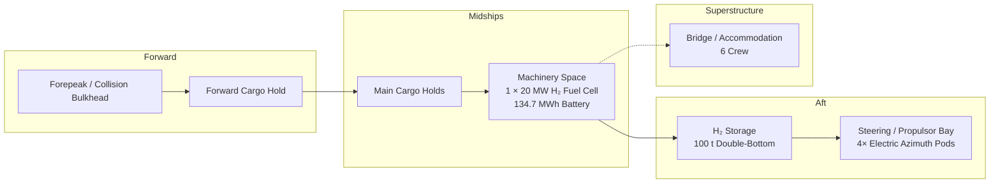

# Vessel Overview Diagram

## Arrangement Zones (Longitudinal)



## Systems Integration

```mermaid
graph TD
    subgraph POWER ["Power Plant"]
        FC[H₂ Fuel Cell<br/>1 × 20 MW]
        BAT[Battery Pack<br/>134.7 MWh]
        H2[H₂ Storage<br/>100 t / 1,833 MWh]
    end

    subgraph PROP ["Propulsion"]
        AZ[Electric Azimuth Pods<br/>4-Pod Array]
    end

    subgraph HULL ["Hull"]
        HF[pcn_cb_0648<br/>Cb 0.575 | Fn 0.375]
    end

    subgraph CARGO ["Cargo"]
        CG[8,196 t Payload<br/>Commercial Freighter]
    end

    subgraph AUX ["Auxiliary"]
        SOL[Solar Array<br/>43 kW Peak]
        HOT[Hotel Load<br/>85 kW]
    end

    H2 -->|hydrogen| FC
    FC -->|electrical| BAT
    BAT -->|bus power| AZ
    AZ -->|thrust| HF
    SOL -->|supplement| BAT
    BAT -->|hotel| HOT
    HF ---|buoyancy| CG

    style FC fill:#2d5016,color:#fff
    style BAT fill:#1a3a5c,color:#fff
    style H2 fill:#4a1a6b,color:#fff
    style AZ fill:#5c3a1a,color:#fff
```

## Key Dimensions

```
  ┌──────────────────────────────────────────────────────────────┐
  │                    LOA: 147.60 m                             │
  │  ┌────────────────────────────────────────────────────────┐  │
  │  │                                                        │  │
  │  │    Beam: 20.48 m                                       │  │
  │  │    Draft: 6.31 m                                       │  │
  │  │    Displacement: 10,938 t                              │  │
  │  │                                                        │  │
  │  └────────────────────────────────────────────────────────┘  │
  └──────────────────────────────────────────────────────────────┘
```

> These diagrams are schematic representations for orientation purposes.
> They do not constitute engineering drawings or a general arrangement plan.
> See [DISCLAIMERS.md](../DISCLAIMERS.md).
